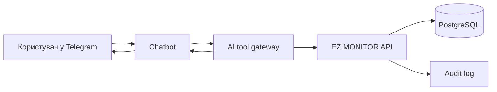

# AI-Доступ До Бізнес Даних

## Правило безпеки

AI не читає БД напряму. Усі запити проходять через API або окремий AI tool gateway, який виконує RBAC, station scopes, rate limits і audit log.

## Цільовий flow

## Приклад

Питання: "Яка виручка за місяць по АЗС №4?"

1. Chatbot визначає користувача й tenant.
2. AI gateway викликає `GET /api/v1/analytics/revenue?stationId=4&period=current_month`.
3. API перевіряє permission `analytics.ai.read` і station scope.
4. API повертає агрегат, а gateway формує коротку відповідь.
5. Подія пишеться в audit log.

## Заборонено

- Передавати AI raw connection string або DB credentials.
- Давати AI необмежений SQL executor у MVP.
- Віддавати дані інших tenant/stations поза scope користувача.
