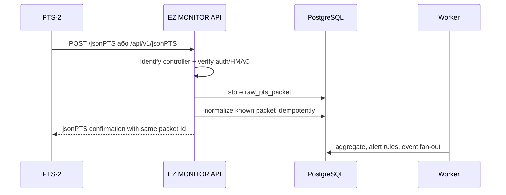

# Remote Server Flows

## Два режими обміну

EZ MONITOR має підтримувати два різні сценарії роботи з PTS-2.

### 1. Automatic upload від PTS-2

PTS-2 сам періодично підключається до нашого серверу й вивантажує події. Це основний режим MVP для накопичення операційних даних без статичної IP-адреси на АЗС.

Automatic upload packet groups для MVP:

- `UploadPumpTransaction`
- `UploadTankMeasurement`
- `UploadInTankDelivery`
- `UploadAlertRecord`
- `UploadPayment`
- `UploadShift`
- `UploadConfiguration`
- `UploadStatus`
- `RequestTagsInformation` -> server response `TagsInformation`

### 2. User-initiated cabinet requests

Користувач у вебкабінеті відкриває сторінку АЗС, ПРК, резервуарів, логів або натискає дію читання. У цей момент backend ініціює jsonPTS request до конкретного контролера або через активний канал зв'язку, або через agent/gateway на АЗС, якщо це буде обрано архітектурно.

Цей режим потрібен для:

- актуального статусу ПРК у реальному часі;
- читання pump status/totals/prices/tag;
- читання tank measurements/calibration fragments;
- читання reports/logging/diagnostics;
- ручного refresh сторінки АЗС без очікування наступного periodic upload.

У MVP цей режим описаний архітектурно і не має виконувати remote pump control. Команди керування (`PumpAuthorize`, `PumpStop`, `PumpEmergencyStop`, `PumpResume`, `PumpSuspend`, `PumpCloseTransaction`) лишаються заблокованими до окремих safety rules.

## Endpoint-и EZ MONITOR для automatic upload

- `POST /pts/jsonPTS` - основний внутрішній endpoint EZ MONITOR.
- `POST /jsonPTS` - короткий endpoint для налаштування PTS-2 remote server.
- `POST /api/v1/jsonPTS` - API-style endpoint під публічний домен.
- `POST /pts/:uri` - сумісність з окремими upload URI aliases, якщо такі будуть налаштовані на нашому сервері.

Конкретні параметри підключення PTS-2 до EZ MONITOR будуть прописані тільки для нашого серверу, коли буде готовий deployment target, домен, TLS і правила авторизації.

## Duplicate packet

Якщо `packetFingerprint` уже існує, API повертає успішне confirmation без повторного створення transaction/alert/ledger.

## WebSocket future

`/pts/ws` лишається feature-flag skeleton. Перед використанням для live-monitoring або command/control потрібно формалізувати safety rules, operator approval, audit і dry-run behavior на реальному controller UI.